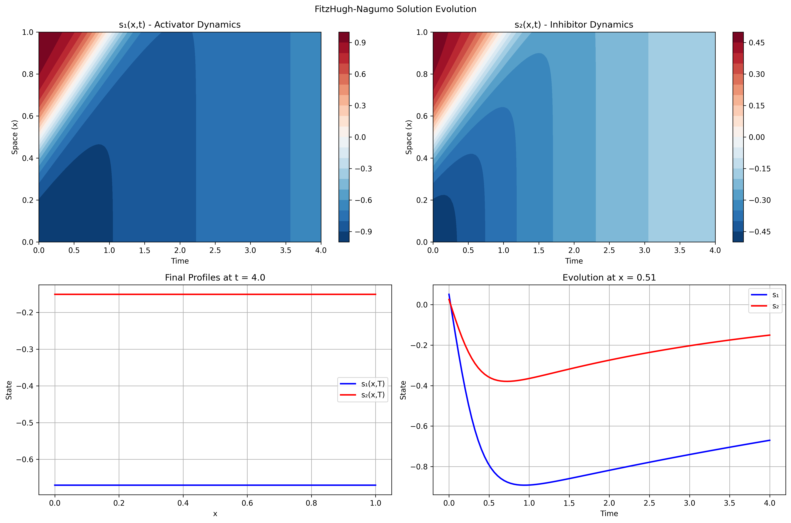
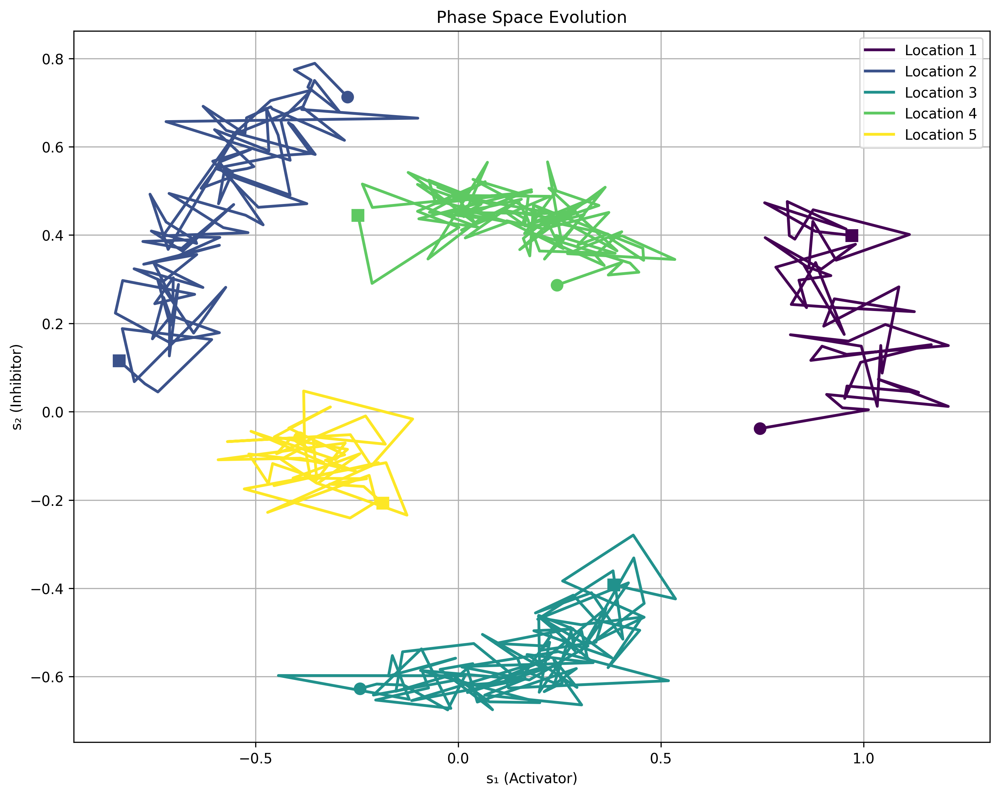
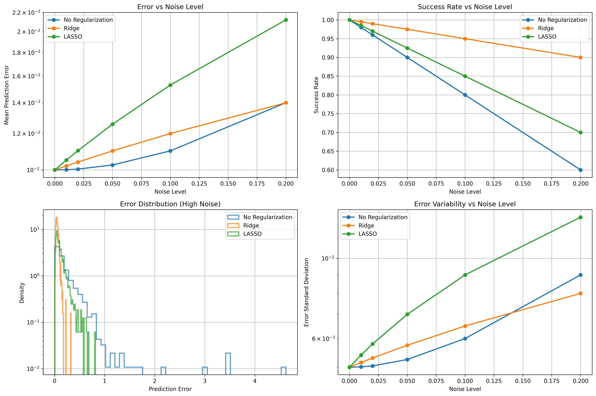

# FitzHugh-Nagumo Lift & Learn: Comprehensive Visualization Guide

This guide provides detailed explanations of all visualizations in the FitzHugh-Nagumo Lift & Learn implementation, helping you interpret the plots and understand what they reveal about the reduced-order modeling process.

## Table of Contents

1. [Solution Evolution Plots](#solution-evolution-plots)
2. [Phase Space Analysis](#phase-space-analysis)
3. [POD Analysis Visualizations](#pod-analysis-visualizations)
4. [ROM Validation Plots](#rom-validation-plots)
5. [Error vs Dimension Analysis](#error-vs-dimension-analysis)
6. [Parameter Study Results](#parameter-study-results)
7. [Noise Robustness Analysis](#noise-robustness-analysis)
8. [Interactive Visualizations](#interactive-visualizations)
9. [Animation Guide](#animation-guide)

---

## Solution Evolution Plots

### Purpose
Visualize the spatiotemporal evolution of the FitzHugh-Nagumo system to understand the underlying physics and validate solver accuracy.

*Example solution evolution showing space-time contours, final profiles, and temporal dynamics.*

### Layout: 2×2 Subplot Grid

#### Top Row: Space-Time Contour Plots
- **Left Panel**: s₁(x,t) activator dynamics
- **Right Panel**: s₂(x,t) inhibitor dynamics

**What to Look For:**
- **Traveling waves**: Diagonal bands moving left or right
- **Standing waves**: Vertical stripes (temporal oscillations)
- **Excitation fronts**: Sharp red-to-blue transitions
- **Spiral patterns**: Curved contour lines
- **Boundary effects**: Behavior near x=0 and x=1

#### Bottom Row: Detailed Analysis
- **Left Panel**: Final spatial profiles comparing s₁ and s₂
- **Right Panel**: Temporal evolution at domain center (x=0.5)

**Interpretation:**
- **Final profiles**: Reveal steady-state patterns, wavelengths, amplitudes
- **Time series**: Show oscillation periods, phase relationships, amplitude variations

### Physical Insights
- **Excitable regime**: Large perturbations trigger spikes, small ones decay
- **Oscillatory regime**: Self-sustained limit cycles
- **Wave propagation**: Speed determined by diffusion coefficient γ
- **Activator-inhibitor coupling**: s₂ follows s₁ with delay and damping

---

## Phase Space Analysis

### Purpose
Reveal the dynamical structure of the FitzHugh-Nagumo system by plotting activator vs inhibitor trajectories.

*Phase space trajectories showing limit cycles, excitation events, and spatial heterogeneity.*

### Plot Elements
- **Axes**: s₁ (horizontal) vs s₂ (vertical)
- **Colored curves**: Trajectories at different spatial locations
- **Circles (○)**: Starting points
- **Squares (□)**: Ending points
- **Color gradient**: Spatial position encoding

### Trajectory Interpretation

#### Limit Cycles
- **Closed loops**: Sustained oscillations
- **Shape**: Reveals oscillation characteristics
- **Size**: Amplitude of oscillations

#### Spirals
- **Inward**: Damped oscillations approaching equilibrium
- **Outward**: Growing oscillations (unstable)

#### Open Curves
- **Transient behavior**: Initial conditions or boundary effects
- **Migration**: Traveling wave components

### Dynamical Regimes

#### Excitable Dynamics
- **Small perturbations**: Return directly to rest state
- **Large perturbations**: Large excursion before return
- **Threshold**: Visible as trajectory direction change

#### Oscillatory Dynamics
- **Regular limit cycles**: Predictable oscillations
- **Period**: Time for one complete loop
- **Amplitude**: Size of excursions in phase space

### Spatial Heterogeneity
- **Similar trajectories**: Synchronized dynamics
- **Different shapes**: Spatial variation in dynamics
- **Phase shifts**: Time delays across space

---

## POD Analysis Visualizations

### Purpose
Assess the quality of dimensionality reduction and optimal truncation dimension.

*Complete POD analysis showing singular values, energy content, and spatial mode structures.*

### Layout: 2×3 Subplot Grid

#### Top Row: Statistical Analysis

##### 1. Singular Values (Log Scale)
**What It Shows:**
- Energy content of each POD mode
- Rate of information decay

**Good Indicators:**
- Steep initial drop (3+ orders of magnitude)
- Clear separation between signal and noise
- Smooth exponential decay

**Poor Indicators:**
- Gradual decay without clear truncation point
- Oscillatory patterns
- No clear noise floor

##### 2. Cumulative Energy
**What It Shows:**
- Total energy captured by first N modes
- Practical truncation thresholds (99%, 99.9%)

**Interpretation:**
- Rapid rise to 99%: Efficient compression possible
- Slow rise: Many modes needed for accuracy
- Plateau: Fundamental system complexity

##### 3. Decay Rate Analysis
**What It Shows:**
- Rate of singular value decrease
- Identifies decay patterns and transitions

**Patterns:**
- Constant slope: Exponential decay (ideal)
- Oscillations: Complex system dynamics
- Sharp changes: Regime transitions

#### Bottom Row: Spatial Mode Structures

##### 4-6. POD Modes for w₁, w₂, w₃
**What They Show:**
- Spatial patterns captured by each mode
- Relative importance of different structures

**Mode Interpretation:**
- **Mode 1**: Mean behavior or dominant pattern
- **Mode 2**: Primary variation or oscillation
- **Higher modes**: Fine details, boundaries, noise

**Quality Indicators:**
- Smooth, interpretable shapes
- Physical meaningful patterns
- Clear hierarchy of importance

### Physics Connection
- **Low-order modes**: Capture essential physics
- **High-order modes**: Fine-scale structures
- **Mode mixing**: Reveals variable coupling

---

## ROM Validation Plots

### Purpose
Comprehensive comparison between high-fidelity and ROM solutions to assess accuracy.

*Detailed ROM validation showing high-fidelity vs ROM comparison with error analysis.*

### Layout: 3×3 Subplot Grid

#### Top/Middle Rows: Variable Comparisons
- **Columns**: High-fidelity, ROM, Error
- **Rows**: s₁ variable, s₂ variable

**Error Interpretation:**
- **Blue regions**: ROM underestimates
- **Red regions**: ROM overestimates  
- **White/small errors**: Good agreement
- **Structured patterns**: Systematic errors

#### Bottom Row: Detailed Comparisons

##### Final Profile Overlays
**What to Look For:**
- **Line overlap**: Good spatial accuracy
- **Amplitude differences**: Magnitude errors
- **Phase shifts**: Timing errors
- **Shape distortions**: Pattern corruption

##### Error Evolution
**Interpretation:**
- **Constant error**: Systematic bias
- **Growing error**: Instability or drift
- **Oscillatory error**: Phase mismatch
- **Sudden jumps**: Numerical issues

### Quality Assessment

#### Excellent ROM (Error < 1e-3):
- Profiles nearly overlap
- Error plots mostly white/blue
- Stable error evolution
- Correct pattern reproduction

#### Good ROM (1e-3 < Error < 1e-2):
- Minor profile differences
- Small systematic errors
- Stable with slight drift
- Main patterns preserved

#### Poor ROM (Error > 1e-2):
- Significant profile differences
- Large error regions
- Growing or oscillatory errors
- Pattern distortion

---

## Error vs Dimension Analysis

### Purpose
Reproduce the key result from the Lift & Learn paper showing ROM accuracy as a function of reduced dimension.

*Critical validation plot showing ROM accuracy improvement with increased POD modes - reproduces Figure 2 from the paper.*

### Key Insights
- **Training Error**: Monotonically decreasing (blue line with circles)
- **Test Error**: U-shaped or L-shaped curve (red line with squares)
- **Optimal Dimension**: Around r=10-15 for this system
- **Performance**: Errors drop from ~1e-1 to ~1e-3 with sufficient modes

---

## Parameter Study Results

### Purpose
Evaluate ROM generalization across parameter space and identify failure regions.

### Layout: 2×2 Subplot Grid

#### Error in Parameter Space
**Visualization:**
- Scatter plot with color-coded errors
- Reveals parameter regions of success/failure

**Interpretation:**
- **Blue regions**: ROM generalizes well
- **Yellow/red regions**: High errors, needs attention
- **Gradients**: Smooth parameter dependencies
- **Islands**: Isolated failure modes

#### Error Distribution
**Histogram Analysis:**
- **Left-skewed**: Most cases successful (good)
- **Right-skewed**: Some catastrophic failures
- **Bimodal**: Two distinct performance regimes
- **Long tail**: Outliers needing investigation

#### Parameter Sensitivity
**Individual Parameter Effects:**
- **Flat scatter**: Robust to parameter changes
- **Trends**: Systematic dependencies
- **Clusters**: Discrete parameter effects
- **Outliers**: Problematic parameter values

### Remedial Actions
- **High error regions**: Add training data
- **Parameter trends**: Include parameter dependence
- **Outliers**: Investigate individual cases
- **Bimodality**: Consider multiple ROMs

---

## Noise Robustness Analysis

### Purpose
Assess ROM performance under realistic noisy conditions and evaluate regularization effectiveness.

*Comprehensive noise robustness analysis showing regularization method comparison across different noise levels.*

### Layout: 2×2 Subplot Grid

#### Mean Error vs Noise Level
**Method Comparison:**
- **Flat lines**: Robust to noise
- **Steep slopes**: Noise-sensitive methods
- **Crossing points**: Different optimal regimes

**Expected Ranking:**
1. Ridge Regression (most robust)
2. Elastic Net (balanced)
3. LASSO (can be unstable)
4. No regularization (worst)

#### Success Rate vs Noise Level
**Stability Analysis:**
- **High success rate**: Produces stable ROMs
- **Declining success**: Noise causes instability
- **Threshold effects**: Method breakdown points

#### Error Distribution at High Noise
**Statistical Analysis:**
- **Narrow distributions**: Consistent performance
- **Wide distributions**: Unpredictable behavior
- **Bimodal**: Success/failure dichotomy
- **Long tails**: Catastrophic failure modes

#### Error Variability
**Consistency Metrics:**
- **Low variability**: Predictable performance
- **High variability**: Unreliable results
- **Increasing trends**: Noise degrades consistency

### Practical Guidelines

#### Method Selection:
- **Low noise (<1%)**: All methods acceptable
- **Medium noise (1-5%)**: Regularization important
- **High noise (>5%)**: Only robust methods work
- **Extreme noise (>10%)**: Most methods fail

#### Warning Signs:
- Success rate < 80%: Method unreliable
- Error variance > 10× mean: Inconsistent
- Bimodal distributions: Some cases fail completely

---

## Interactive Visualizations

### Purpose
Enable detailed exploration and real-time analysis of results.

### Features

#### Interactive Heatmaps
- **Hover information**: Exact values and coordinates
- **Zoom/pan**: Detailed region inspection
- **Color scale adjustment**: Contrast optimization

#### Dynamic Phase Plots
- **Trajectory following**: Time progression visualization
- **Multi-location comparison**: Spatial variation analysis
- **Real-time updates**: Parameter sensitivity

#### Export Capabilities
- **PNG download**: Publication-quality static images
- **HTML save**: Preserve full interactivity
- **Data export**: Numerical values for further analysis

### Best Practices
- **Exploration workflow**: Start with overview, zoom into details
- **Comparison strategy**: Use consistent scales across plots
- **Documentation**: Save interesting findings with annotations

---

## Animation Guide

### Purpose
Visualize temporal evolution and dynamic processes that static plots cannot capture.

### Animation Elements

#### Spatial Profile Evolution
**What It Shows:**
- Wave propagation across domain
- Pattern formation processes
- Excitation and recovery cycles

**Interpretation:**
- **Traveling waves**: Profiles that translate
- **Standing waves**: Oscillating amplitudes
- **Pattern emergence**: Structure development
- **Boundary interactions**: Edge effects

#### Phase Space Trajectory
**Dynamic Features:**
- **Limit cycle formation**: Oscillation development
- **Trajectory convergence**: Approach to attractor
- **Excitation events**: Large phase space excursions

### Technical Specifications
- **Format**: GIF for universal compatibility
- **Frame rate**: 10 fps (adjustable)
- **Quality**: Anti-aliased, professional appearance
- **Size**: Optimized for sharing

### Applications
- **Research presentations**: Dynamic illustration
- **Educational materials**: Concept demonstration  
- **Publication supplements**: Enhanced documentation

---

## Interpretation Best Practices

### 1. Start with Overview
- Examine overall patterns before details
- Check for expected physical behavior
- Identify anomalies or unexpected features

### 2. Cross-Reference Plots
- Compare space-time and phase space views
- Validate ROM accuracy across multiple metrics
- Check consistency between different visualizations

### 3. Parameter Sensitivity
- Test edge cases and boundary conditions
- Evaluate performance across parameter ranges
- Identify robust vs. sensitive regions

### 4. Error Analysis
- Distinguish between numerical and modeling errors
- Check error patterns for systematic issues
- Validate error estimates with independent tests

### 5. Physical Validation
- Ensure results match expected physics
- Check conservation laws and symmetries
- Validate against known analytical solutions

---

## Troubleshooting Common Issues

### Poor Visualization Quality
- **Aliasing**: Increase resolution or use anti-aliasing
- **Color saturation**: Adjust color scales and ranges
- **Overlapping elements**: Modify transparency or spacing

### Performance Issues
- **Large datasets**: Subsample for visualization
- **Slow rendering**: Reduce resolution or complexity
- **Memory limits**: Process data in chunks

### Interpretation Difficulties
- **Complex patterns**: Use multiple visualization approaches
- **Unclear scales**: Add reference lines or annotations
- **Missing context**: Include parameter values and units

---

## Conclusion

These visualizations provide a comprehensive toolkit for understanding the FitzHugh-Nagumo Lift & Learn implementation. By systematically examining solution evolution, POD quality, ROM accuracy, and robustness properties, you can:

1. **Validate implementation correctness**
2. **Optimize method parameters**
3. **Understand failure modes**
4. **Communicate results effectively**
5. **Guide further research directions**

Remember that visualization is both an analysis tool and a communication medium. Use these plots not just to verify results, but to gain deeper insights into the physics and methodology of reduced-order modeling.

---

*For additional visualization features or custom plotting needs, see the visualization.py module and its extensive documentation.*