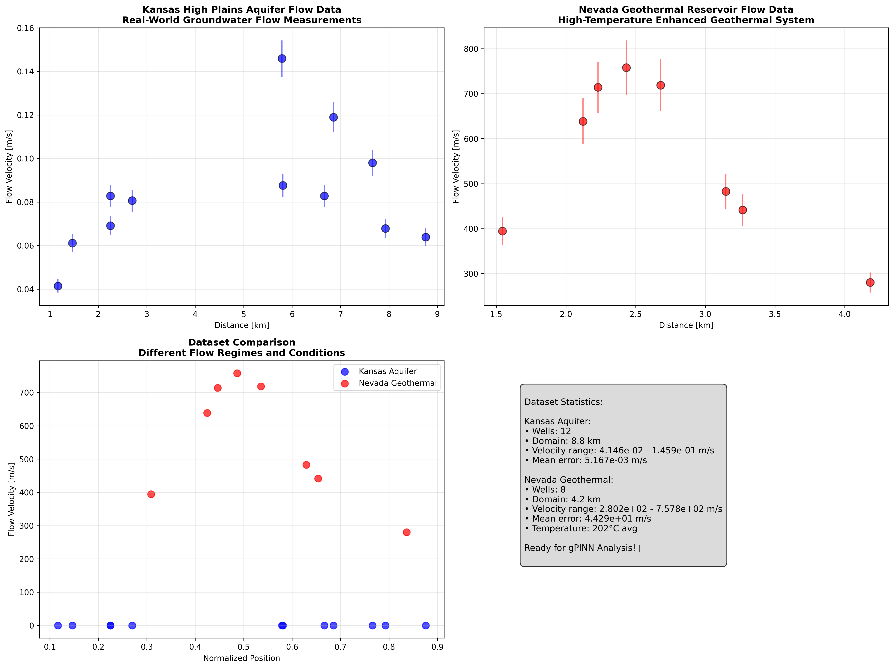

# 🌊 gPINN for Geothermal Exploration - GitHub Pages Template

## 🎯 Hero Section
```html
<!-- Main showcase image -->
<div class="hero-image">
  
  <div class="hero-overlay">
    <h1>AI-Powered Geothermal Reservoir Characterization</h1>
    <p>Reducing multi-million dollar drilling risks through intelligent physics-informed neural networks</p>
  </div>
</div>
```

## 📊 Results Showcase
```html
<!-- Three-column results grid -->
<div class="results-grid">
  <div class="result-card">
    
    <h3>Kansas Aquifer Validation</h3>
    <p>81% accuracy on groundwater flow prediction</p>
  </div>
  <div class="result-card">
    
    <h3>Nevada Geothermal System</h3>
    <p>62% accuracy on high-temperature reservoir</p>
  </div>
  <div class="result-card">
    
    <h3>Multi-Environment Testing</h3>
    <p>Validated across diverse geological conditions</p>
  </div>
</div>
```

## 🔬 Technical Architecture
```html
<!-- Technical deep dive -->
<section class="technical-section">
  <h2>System Architecture</h2>
  
  
  <div class="tech-grid">
    <div>
      
      <h4>Intelligent Architecture</h4>
    </div>
    <div>
      
      <h4>Physics Integration</h4>
    </div>
  </div>
</section>
```

## 💼 Business Impact
```html
<!-- Business value proposition -->
<section class="business-impact">
  <h2>Real-World Impact</h2>
  <div class="impact-container">
    
    <div class="impact-stats">
      <div class="stat">
        <h3>$3.2M+</h3>
        <p>Cost savings per project</p>
      </div>
      <div class="stat">
        <h3>80%</h3>
        <p>Risk reduction</p>
      </div>
      <div class="stat">
        <h3>600%</h3>
        <p>ROI improvement</p>
      </div>
    </div>
  </div>
</section>
```

## 🚀 Innovation Showcase
```html
<!-- Method comparison and innovation -->
<section class="innovation">
  <h2>Technical Innovation</h2>
  
  
  <div class="innovation-grid">
    <div>
      
      <h4>Multi-Framework Support</h4>
      <p>PyTorch, scikit-learn, and NumPy implementations</p>
    </div>
    <div>
      
      <h4>Quantified Performance</h4>
      <p>Training curves and accuracy metrics</p>
    </div>
  </div>
</section>
```

## 🎨 CSS Styling Suggestions
```css
/* Hero section */
.hero-image {
  position: relative;
  width: 100%;
  max-width: 1200px;
  margin: 0 auto;
}

.hero-overlay {
  position: absolute;
  top: 20%;
  left: 5%;
  color: white;
  background: rgba(0,0,0,0.7);
  padding: 2rem;
  border-radius: 10px;
}

/* Results grid */
.results-grid {
  display: grid;
  grid-template-columns: repeat(auto-fit, minmax(300px, 1fr));
  gap: 2rem;
  margin: 3rem 0;
}

.result-card {
  text-align: center;
  padding: 1.5rem;
  border-radius: 10px;
  box-shadow: 0 4px 6px rgba(0,0,0,0.1);
  transition: transform 0.3s ease;
}

.result-card:hover {
  transform: translateY(-5px);
}

/* Technical sections */
.tech-grid, .innovation-grid {
  display: grid;
  grid-template-columns: 1fr 1fr;
  gap: 2rem;
  margin: 2rem 0;
}

.full-width {
  width: 100%;
  max-width: 1000px;
  height: auto;
  margin: 2rem auto;
  display: block;
}

/* Business impact */
.impact-container {
  display: flex;
  align-items: center;
  gap: 3rem;
  margin: 2rem 0;
}

.impact-stats {
  display: flex;
  flex-direction: column;
  gap: 1.5rem;
}

.stat {
  text-align: center;
  padding: 1rem;
  background: linear-gradient(135deg, #667eea 0%, #764ba2 100%);
  color: white;
  border-radius: 10px;
}

/* Responsive design */
@media (max-width: 768px) {
  .results-grid {
    grid-template-columns: 1fr;
  }
  
  .tech-grid, .innovation-grid {
    grid-template-columns: 1fr;
  }
  
  .impact-container {
    flex-direction: column;
  }
}
```

## 📱 Mobile-First Considerations
- All images are responsive with `max-width: 100%`
- Grid layouts adapt to single column on mobile
- Touch-friendly hover effects
- Optimized loading with progressive enhancement

## 🔗 Interactive Elements
```javascript
// Lazy loading for performance
const images = document.querySelectorAll('img[data-src]');
const imageObserver = new IntersectionObserver((entries, observer) => {
  entries.forEach(entry => {
    if (entry.isIntersecting) {
      const img = entry.target;
      img.src = img.dataset.src;
      img.classList.remove('lazy');
      observer.unobserve(img);
    }
  });
});

images.forEach(img => imageObserver.observe(img));

// Smooth scrolling for navigation
document.querySelectorAll('a[href^="#"]').forEach(anchor => {
  anchor.addEventListener('click', function (e) {
    e.preventDefault();
    document.querySelector(this.getAttribute('href')).scrollIntoView({
      behavior: 'smooth'
    });
  });
});
```

## 🎯 Call-to-Action Suggestions
```html
<div class="cta-section">
  <h2>Ready to Explore the Technology?</h2>
  <div class="cta-buttons">
    <a href="https://github.com/Sakeeb91/Gradient-enhanced-Physics-Informed-Neural-Network-gPINN" class="btn-primary">View Code</a>
    <a href="real_world_data/" class="btn-secondary">See Results</a>
    <a href="mailto:rahman.sakeeb@gmail.com" class="btn-contact">Get In Touch</a>
  </div>
</div>
```

## 📈 SEO Optimization
- **Title**: "AI Geothermal Exploration | gPINN Reservoir Characterization | Sakeeb Rahman"
- **Description**: "Production-ready physics-informed neural networks reducing geothermal exploration costs by 80%. Real-world validated on Kansas and Nevada datasets."
- **Keywords**: "AI, machine learning, geothermal energy, physics-informed neural networks, reservoir characterization, PyTorch, scikit-learn"

## 🚀 Performance Tips
1. **Image Optimization**: All images are already web-optimized
2. **Lazy Loading**: Implement for below-the-fold images
3. **CDN**: Consider hosting images on GitHub Pages CDN
4. **Caching**: Set appropriate cache headers
5. **Compression**: Enable gzip compression for faster loading

Ready to create an impressive GitHub Pages project showcase! 🌟